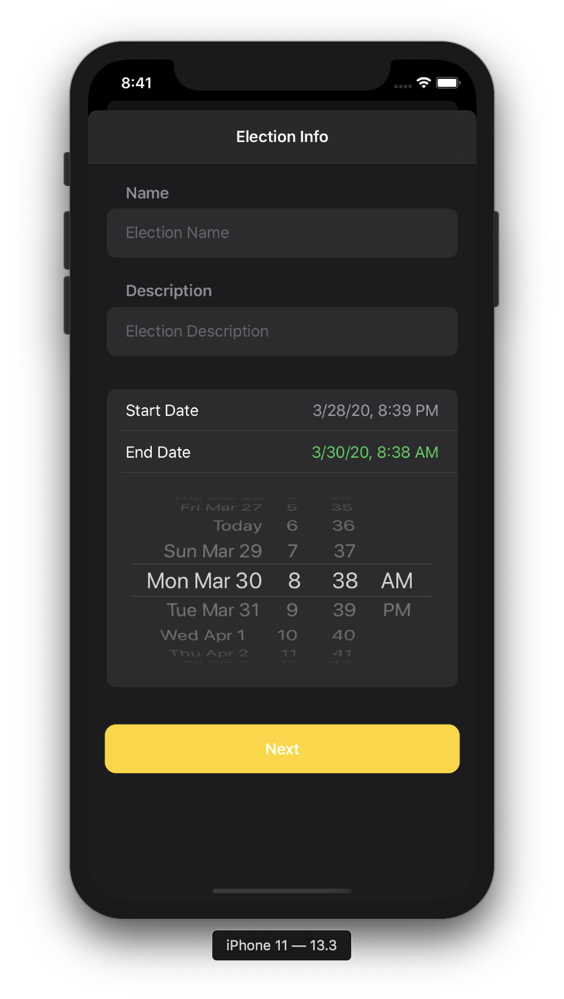
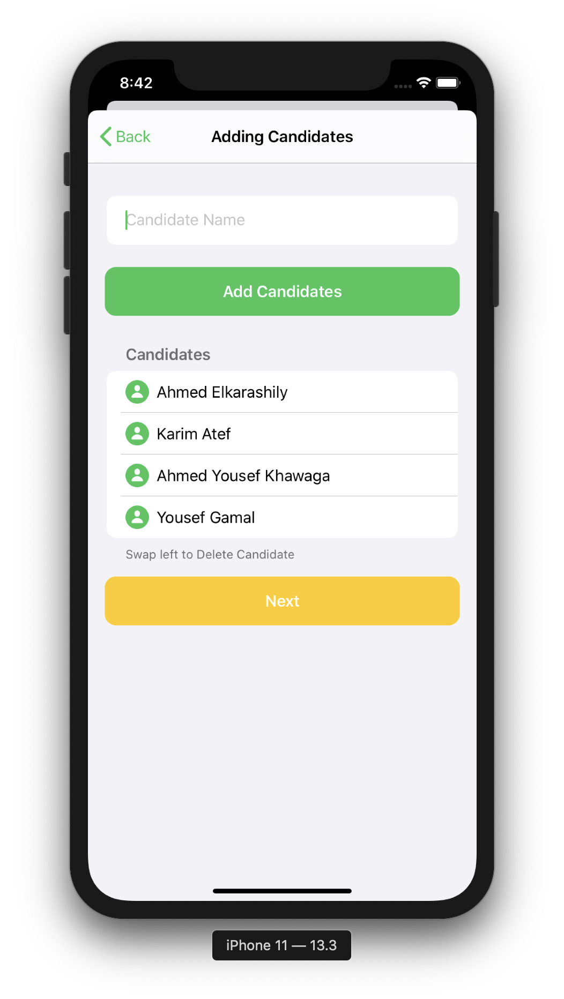
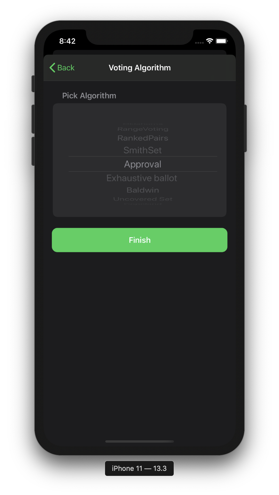
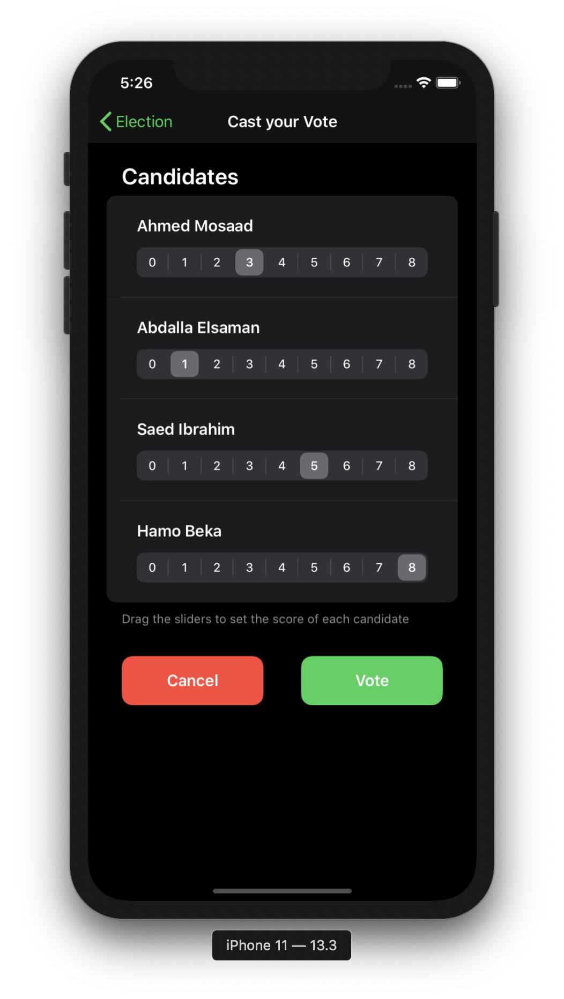
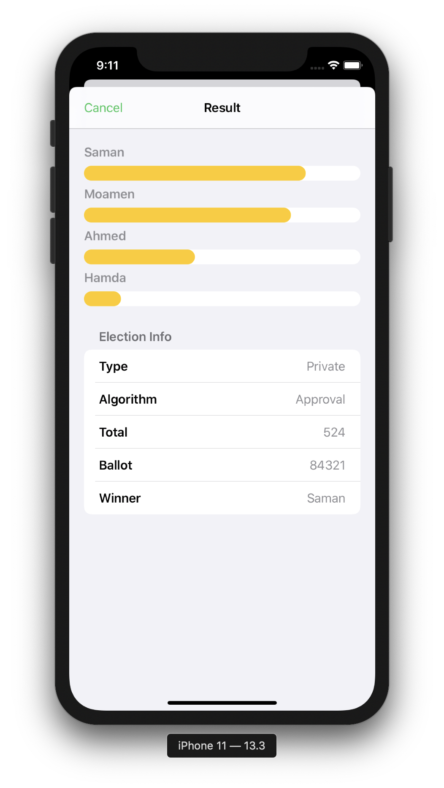
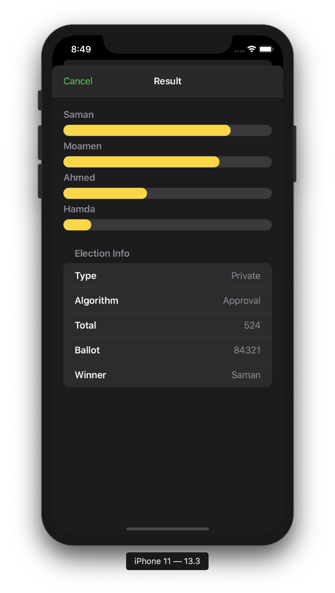
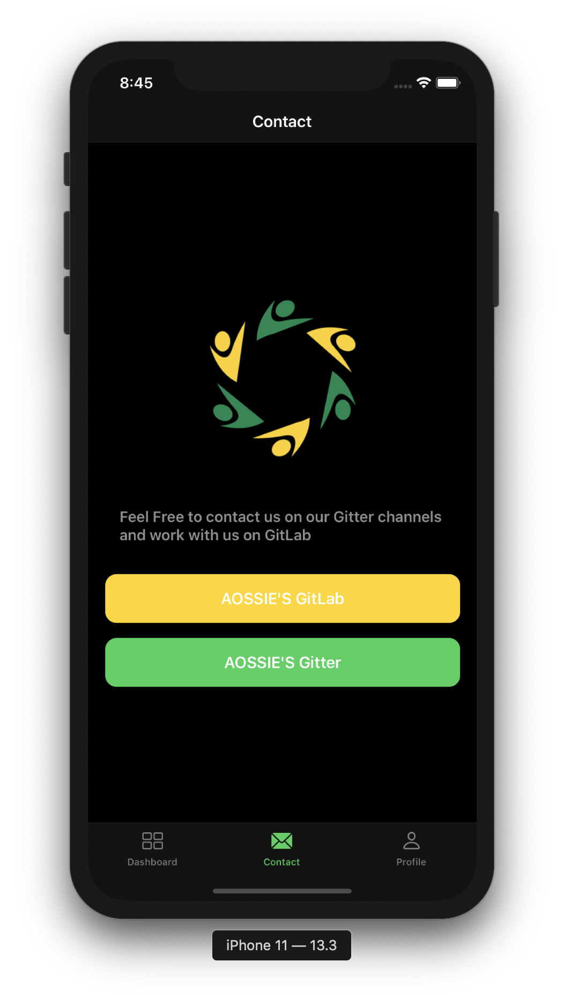

# Agora
Agora UI for iOS App Attempt using SwiftUI
# Splash Screen
|  |  | 
|:---:|:---:|

# Sign Up
|  |  | 
|:---:|:---:|

# Log In
|  |  | 
|:---:|:---:|

# Forget Password
|  | 

# Reset Password
|  |  | 
|:---:|:---:|

# Dashboard
|  |  | 
|:---:|:---:|

# Election Detail
|  |  | 
|:---:|:---:|

# Create Election 1
|  |  | 
|:---:|:---:|

# Create Election 2
|  |  | 
|:---:|:---:|

# Create Election 3
|  |  | 
|:---:|:---:|

# Delete Election
|  |  | 
|:---:|:---:|

# Add Voters
|  |  | 
|:---:|:---:|

# Voting Ballot 1
|  |  | 
|:---:|:---:|

# Voting Ballot 2
|  |  | 
|:---:|:---:|

# Voting Ballot 3
|  |  | 
|:---:|:---:|

# Result
|  |  | 
|:---:|:---:|

# Contact
|  |  | 
|:---:|:---:|

# Profile
|  |  | 
|:---:|:---:|

